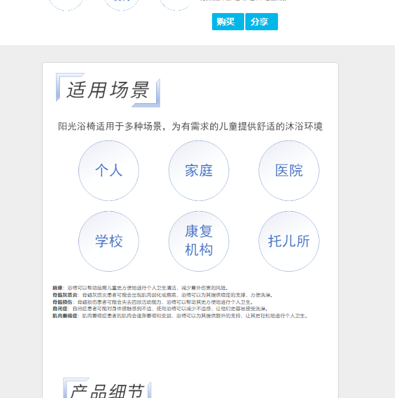
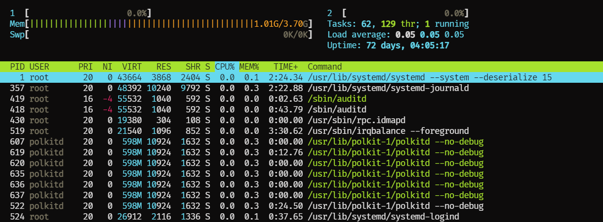
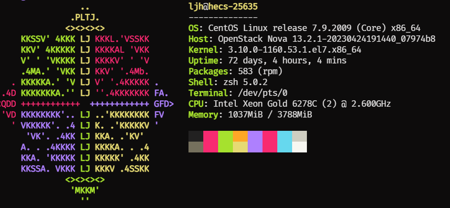
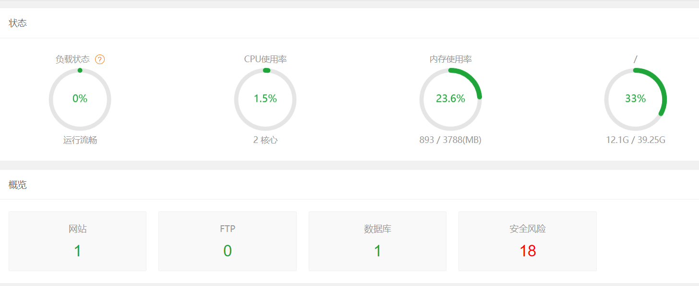
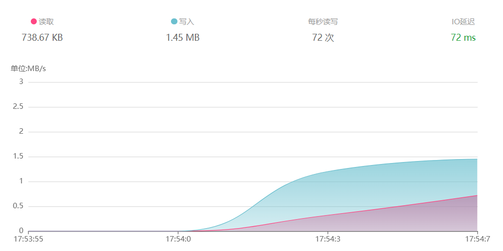
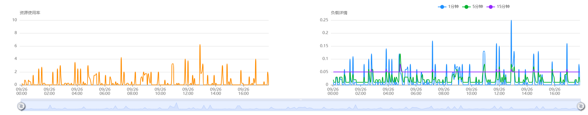
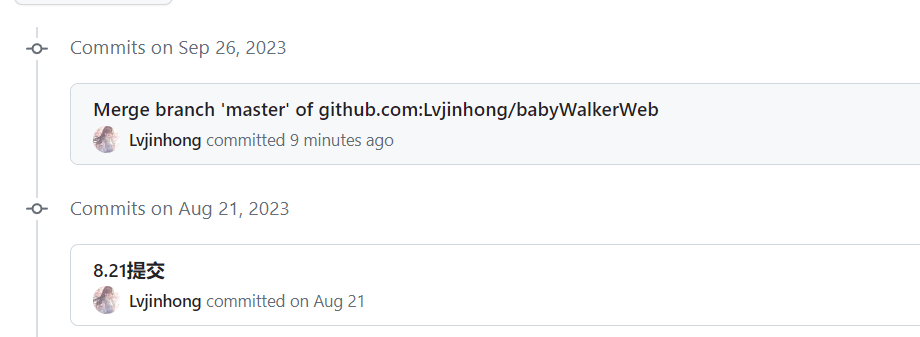

# 八九月工作报告

## 目录

-   [网站](#网站)
    -   [完善：](#完善)

    -   [移动端重构：完成了移动端页面的重构，解决了手机端响应式布局杂乱的问题](#移动端重构完成了移动端页面的重构解决了手机端响应式布局杂乱的问题)

    -   [资料填充](#资料填充)

-   [服务器运维相关【日常性能维护】](#服务器运维相关日常性能维护)
    -   [解决了部署到用户目录下网站出现403禁止访问的情况（需要部署到www用户下）](#解决了部署到用户目录下网站出现403禁止访问的情况需要部署到www用户下)

    -   [监视CPU使用率，内存使用情况，磁盘I/O， 持续基于CentOS源和系统包的更新来对网站的nginx，node等软件进行定期更新](#监视CPU使用率内存使用情况磁盘IO-持续基于CentOS源和系统包的更新来对网站的nginxnode等软件进行定期更新)

    -   [基于 宝塔面板，Prometheus+Grafana 搭建服务器监控，监控网络流量 及 磁盘 内存 IO开销等](#基于-宝塔面板PrometheusGrafana-搭建服务器监控监控网络流量-及-磁盘-内存-IO开销等)

    -   [每周进行全量或增量备份，并定期进行恢复演练，验证备份数据的可用性](#每周进行全量或增量备份并定期进行恢复演练验证备份数据的可用性)

    -   [更新Github repository，解决了merge冲突问题](#更新Github-repository解决了merge冲突问题)

## 网站

### 完善：

-   修复了 目前存在 主页面点击详情无法跳转的bug
-   **完成了 各产品页的轮播图**

    

### 移动端重构：完成了移动端页面的重构，解决了手机端响应式布局杂乱的问题

### 资料填充

**完成了 洗澡椅的资料填充工作**，并对网页排版进行了一部分优化

**维护云主机的日常运行，快照保存，ssh服务，clash，nginx服务以及网络负载均衡等等**

## 服务器运维相关【日常性能维护】

#### **解决了部署到用户目录下网站出现403禁止访问的情况（需要部署到www用户下）**

#### **监视CPU使用率，内存使用情况，磁盘I/O， 持续基于CentOS源和系统包的更新来对网站的nginx，node等软件进行定期更新**

#### 基于 宝塔面板，**Prometheus+Grafana** 搭建服务器监控，监控网络流量 及 磁盘 内存 IO开销等

#### 每周进行全量或增量备份，并定期进行恢复演练，验证备份数据的可用性

维护服务器各项服务的正常使用，包括但不限于clash，网站快照备份（同步到github）

对服务器进行全面检查，发现以下风险项，后期排期解决：

#### 更新Github repository，解决了merge冲突问题

**服务器**上网站已经更新
