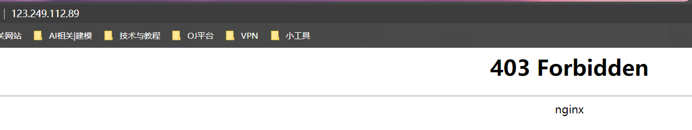
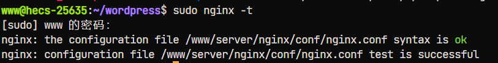
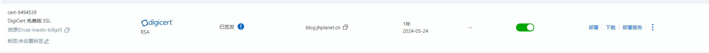
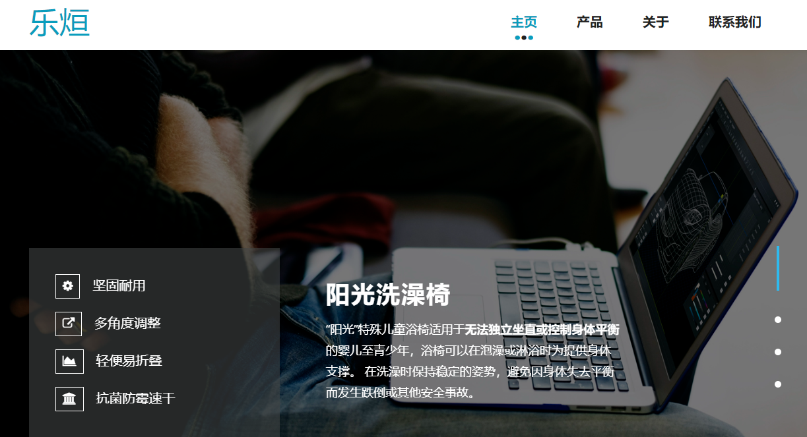
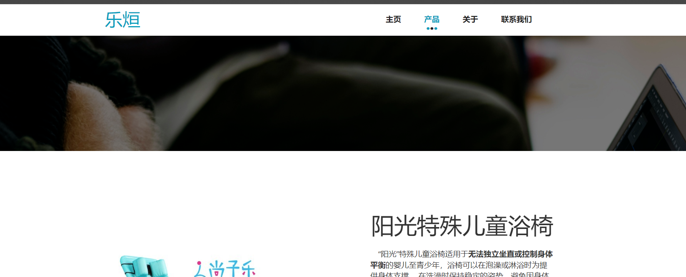
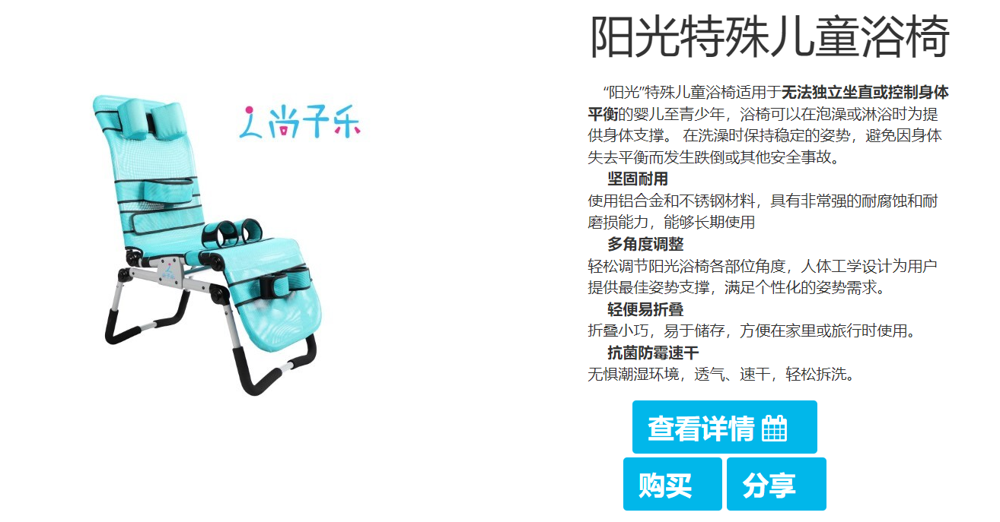
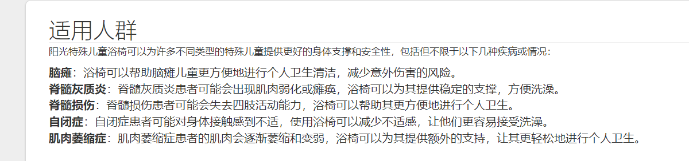
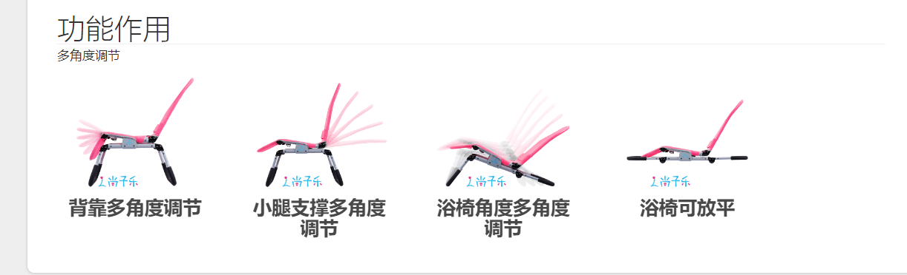
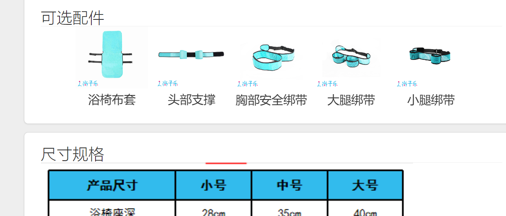

# 工作报告

## 目录

-   [服务器迁移【完成】](#服务器迁移完成)

-   [Github配置【完成】](#Github配置完成)

-   [Mysql数据库配置【完成】](#Mysql数据库配置完成)

-   [PHP-7.4.33配置【完成】](#PHP-7433配置完成)

-   [Nginx服务器配置【完成】](#Nginx服务器配置完成)

-   [负载均衡优化：](#负载均衡优化)
    -   [关于前端页面，主要是进行页面的公司相关的内容填充，具体的工作有：](#关于前端页面主要是进行页面的公司相关的内容填充具体的工作有)

    -   [产品画廊与产品详情页](#产品画廊与产品详情页)

    -   [关于页](#关于页)

华为云服务器不同于腾讯云，没有提供一键式建站镜像，这导致我们在项目正向进度方面遇到了一些困难，但我们采取了以下措施来解决问题

## 服务器迁移【完成】

腾讯云服务器到期，将之前的数据保存下来，然后

## Github配置【完成】

-   配置SSH密钥，以便安全地连接到Github。
-   安装clash for linux，以开启反向代理，确保顺畅的网络连接。
-   在Git中重新设置全局端口，以便正常访问Github链接

## Mysql数据库配置【完成】

## PHP-7.4.33配置【完成】

确保网站能够顺利运行所需的PHP环境

## Nginx服务器配置【完成】

由于在移动端直接访问网站时会显示不安全而被拒绝，为了使网站能够被广泛访问，需要配置SSL证书

&#x20;于是去阿里云上面申请了SSL证书，然后下载下来后再Nginx服务器中进行了相应的配置

## 负载均衡优化：

1.  首先在服务器集群中部署了一套负载均衡软件。为了实现负载均衡，Nginx、HAProxy，Apache HTTP Server。这些软件具有强大的负载均衡功能和灵活的配置。
2.  在负载均衡软件中，选择负载均衡算法包括轮询、最小连接数、IP散列等。确保请求被均匀地分配到不同的后端服务器上，以实现负载均衡的效果。
3.  配置后端服务器池 ，其中包含多台具有相同应用程序副本的服务器。负载均衡软件将请求转发到这些后端服务器上，以实现负载的分散和优化。
4.  并且完成了监控和自动伸缩，以及高可用性和故障转移的一系列配置。

同时解决了连接服务器失败的问题

### 关于前端页面，主要是进行页面的公司相关的内容填充，具体的工作有：

导航栏优化

主页内容填充，背景图更改为轮播图

新增产品介绍页，

对产品页和关于界面进行了内容填充

优化了各页面布局方式，整合了各模块

基于现已搭建的网站基础，完成了产品详情页的布局融合及优化（与原先的网站框架），修复了多布局协同部署时导致的冲突问题

### 产品画廊与产品详情页

1.  修复了 产品画廊 布局展示错乱的bug，优化了鼠标悬浮时的动画效果，以及点击页面时触发的产品详情页跳转问题
2.  产品详情页布局融合及优化 在现有的网站基础上，我致力于完善和优化产品详情页的布局。通过与原先的网站框架进行融合，我确保了整体风格的一致性，并解决了布局融合过程中可能导致的冲突问题。这样，用户在浏览产品详情页时会感受到更加统一和流畅的用户体验。
3.  修复产品画廊布局展示问题 在之前的版本中，产品画廊存在布局展示错乱的问题。解决了这个bug，并成功修复了相关的布局问题。
4.  优化鼠标悬浮动画效果 为了提升用户对产品的视觉体验，对鼠标悬浮时的动画效果进行了优化。通过增强动画效果的流畅性和吸引力，用户在浏览产品时可以更加直观地感受到产品的特点和魅力。
5.  解决产品详情页跳转问题 之前，点击页面时会触发产品详情页的跳转问题。现在，用户在点击页面时不会再意外触发产品详情页的跳转，保证了正常的页面浏览体验。

    
6.  优化了cookie的存取逻辑，以及cookie弹窗的显示问题

    
7.  优化了产品介绍卡片中详情介绍的js代码，以及按钮居中显示问题，优化了布局展示，解决了原有残缺的轮播图样式造成的布局冲突问题

    

8.  基于现有的网站 填充公司资料，优化布局展示

    

    

    

### 关于页

**已上传Github，解决了连接github仓库时的ssh配置问题，以及超时问题**

