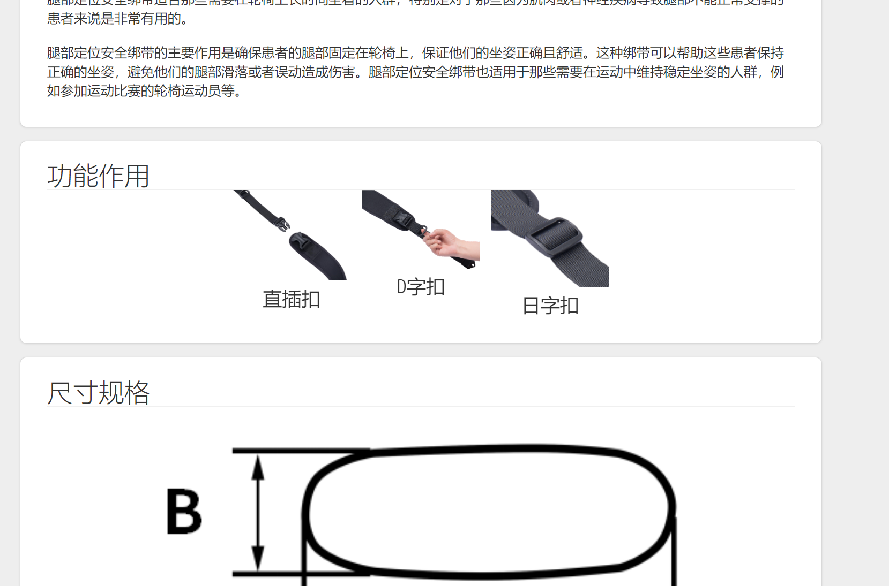
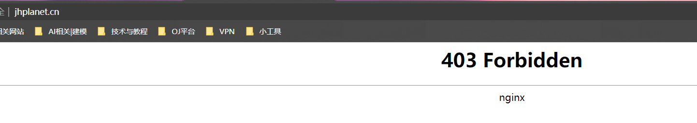
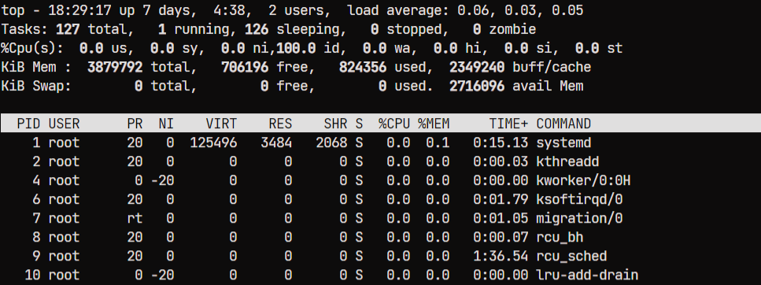
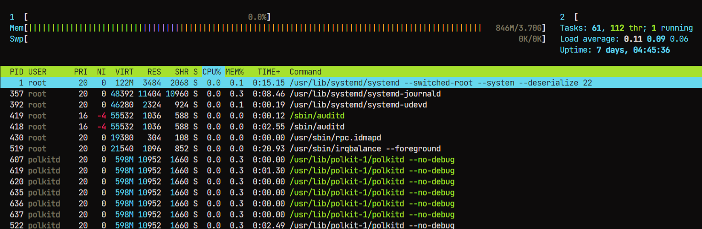
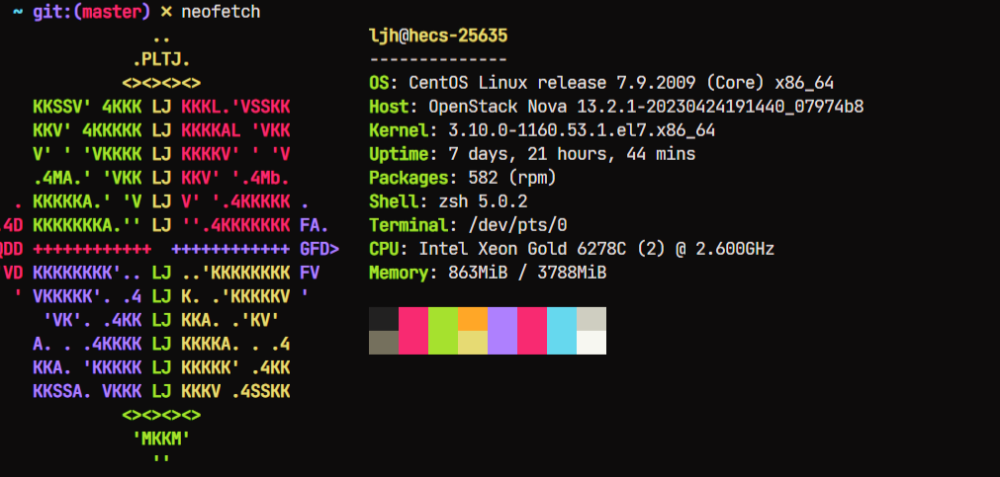
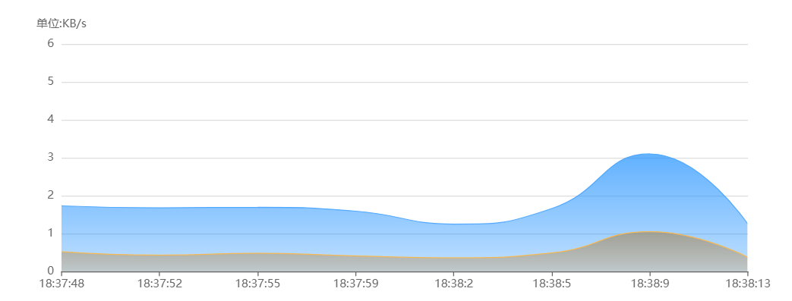
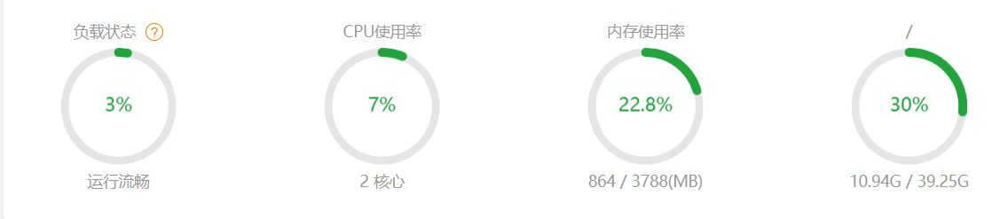

# 七月份工作报告

## 目录

-   [网站进度相关](#网站进度相关)
    -   [修补了七月之前网站存在的BUG 以及调整布局 使得更加美观](#修补了七月之前网站存在的BUG-以及调整布局-使得更加美观)
    -   [完成了商品展示页轮播图的制作，（暂时不能点击，但是可以自动切换，后期再进行修改，由于 模板布局依赖太多，无法使用最新的框架，所以该轮播图是纯js实现的，导致美观上存在限制）](#完成了商品展示页轮播图的制作暂时不能点击但是可以自动切换后期再进行修改由于-模板布局依赖太多无法使用最新的框架所以该轮播图是纯js实现的导致美观上存在限制)
    -   [完成了产品画廊中 骨盆安全绑带， 脚部安全绑带， 胸部安全绑带  网站页面的搭建和资料填充， 美化了 文字排版布局](#完成了产品画廊中-骨盆安全绑带-脚部安全绑带-胸部安全绑带--网站页面的搭建和资料填充-美化了-文字排版布局)
-   [服务器运维相关【日常性能维护】](#服务器运维相关日常性能维护)
    -   [解决了部署到用户目录下网站出现403禁止访问的情况（需要部署到www用户下）](#解决了部署到用户目录下网站出现403禁止访问的情况需要部署到www用户下)
    -   [监视CPU使用率，内存使用情况，磁盘I/O， 持续基于CentOS源和系统包的更新来对网站的nginx，node等软件进行定期更新。](#监视CPU使用率内存使用情况磁盘IO-持续基于CentOS源和系统包的更新来对网站的nginxnode等软件进行定期更新)
    -   [基于 Prometheus+Grafana 搭建服务器监控，监控网络流量 及 磁盘 内存 IO开销等](#基于-PrometheusGrafana-搭建服务器监控监控网络流量-及-磁盘-内存-IO开销等)
    -   [每周进行全量或增量备份，并定期进行恢复演练，验证备份数据的可用性](#每周进行全量或增量备份并定期进行恢复演练验证备份数据的可用性)

## 网站进度相关

#### 修补了七月之前网站存在的BUG 以及调整布局 使得更加美观

bug修补效果 可在网站体验

#### 完成了商品展示页轮播图的制作，（暂时不能点击，但是可以自动切换，后期再进行修改，由于 模板布局依赖太多，无法使用最新的框架，所以该轮播图是纯js实现的，导致美观上存在限制）

#### 完成了产品画廊中 骨盆安全绑带， 脚部安全绑带， 胸部安全绑带  网站页面的搭建和资料填充， 美化了 文字排版布局

更新了联系页面

## 服务器运维相关【日常性能维护】

#### **解决了部署到用户目录下网站出现403禁止访问的情况（需要部署到www用户下）**

#### **监视CPU使用率，内存使用情况，磁盘I/O， 持续基于CentOS源和系统包的更新来对网站的nginx，node等软件进行定期更新。**

#### 基于 **Prometheus+Grafana** 搭建服务器监控，监控网络流量 及 磁盘 内存 IO开销等

#### 每周进行全量或增量备份，并定期进行恢复演练，验证备份数据的可用性

维护服务器各项服务的正常使用，包括但不限于clash，网站快照备份（同步到github）

对服务器进行全面检查，发现以下风险项，后期排期解决：

