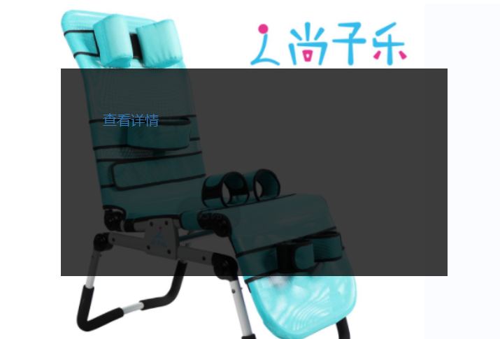
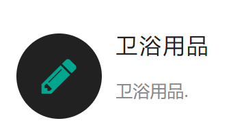
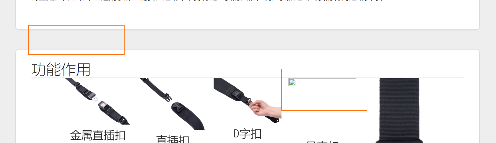
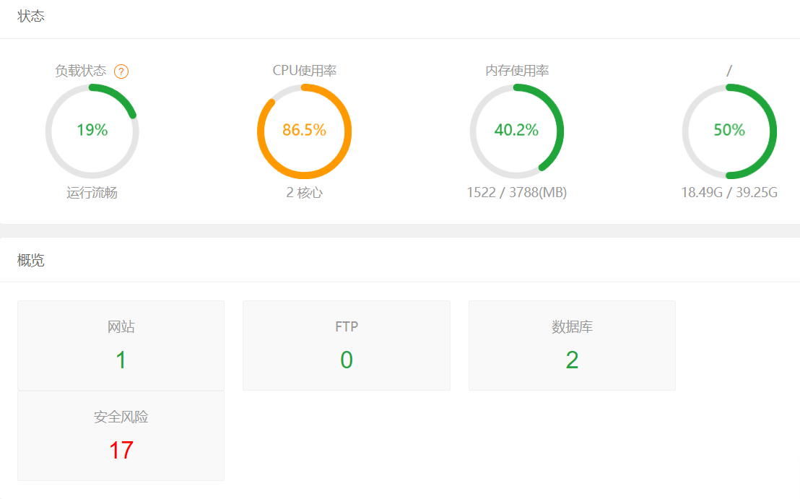
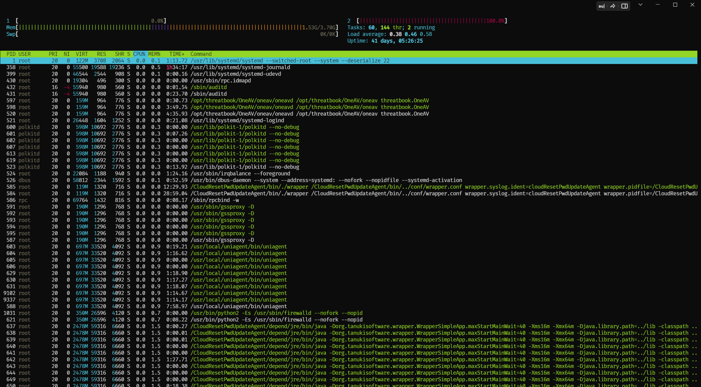
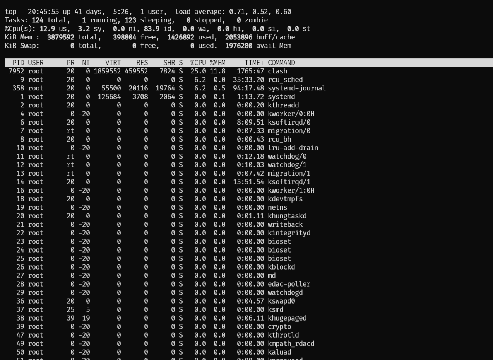
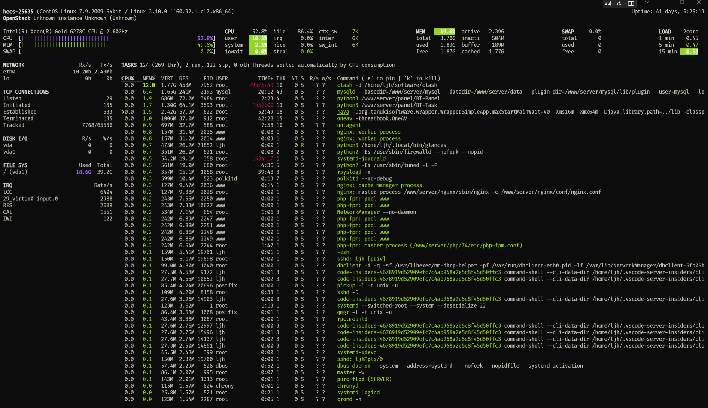
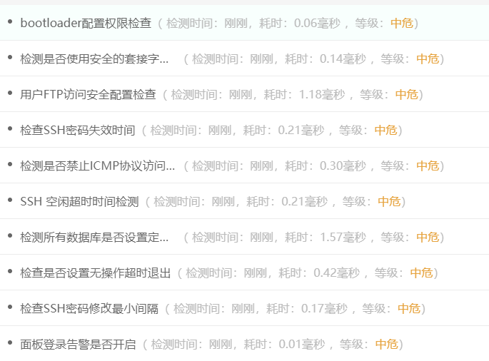

# Latest Report

## 目录

-   [一、网站优化](#一网站优化)
    -   [优化首页产品详情动画效果](#优化首页产品详情动画效果)
    -   [更换图床](#更换图床)
-   [二、服务器运维相关【日常性能维护】](#二服务器运维相关日常性能维护)
    -   [CPU、内存和磁盘I/O监控](#CPU内存和磁盘IO监控)
-   [三、数据备份与恢复](#三数据备份与恢复)
    -   [备份策略](#备份策略)
    -   [恢复演练](#恢复演练)
-   [四、软件定期更新](#四软件定期更新)
    -   [更新Github repository，解决各种冲突问题](#更新Github-repository解决各种冲突问题)

## 一、网站优化

#### 优化首页产品详情动画效果

-   调整移动端布局，使得适配多种机型，尽量保持一致
-   修复首页轮播图卡顿及有时无法显示图片的问题，减少中间路由，减少缓存，优化产品页跳转和显示速度，

#### 更换图床

由于之前的图床不够稳定，导致部分图片有时无法显示。 故选择 阿里云CDN云存储作为图床，按量计费

同时优化产品页 段落间距显示

## 二、服务器运维相关【日常性能维护】

#### CPU、内存和磁盘I/O监控

-   **工具与技术**：采用了宝塔面板，结合**Prometheus+Grafana**，搭建了一套全面的服务器监控系统。
-   **核心指标监控**：重点监视CPU使用率、内存使用情况和磁盘I/O，确保系统运行在最佳状态。
-   **性能优化**：通过持续监测，及时发现并解决了潜在的性能瓶颈。
-   由于宝塔上安全防火墙需要手动付费，故部署**pfSense**开源防火墙， 同时定期检测安全风险

## 三、数据备份与恢复

#### 备份策略

-   **实施方案**：每周进行全量或增量备份，确保数据的完整性和及时性。
-   **工具和方法**：采用了行业标准的备份工具和方法，保证了备份数据的一致性和可靠性。

#### 恢复演练

-   **定期演练**：定期进行数据恢复演练，验证备份数据的可用性和恢复流程的有效性。
-   **风险管理**：这一步骤是对数据安全管理的重要补充，确保在实际数据损失事件中能够快速、有效地恢复业务

## 四、软件定期更新

-   **更新策略**：基于CentOS源和系统包的持续更新，对网站的关键软件如nginx、node等进行了定期更新。
-   **维护重点**：确保了软件版本的最新性和安全性，预防了安全漏洞和兼容性问题
-   **问题**：高流量下的网站响应缓慢或服务器过载。
    -   **解决方案**：
        -   优化数据库查询，确保数据库索引有效。
        -   使用缓存技术减少服务器负载。
        -   应用负载均衡器分散流量。
        -   进行资源扩展，如增加服务器、优化硬件配置
-   **问题**：新更新的代码或第三方服务导致与现有系统的兼容性问题。
    -   **解决方案**：
        -   在生产环境部署之前进行彻底的测试。
        -   使用版本控制，确保可回滚到稳定版本。
        -   持续集成和持续部署(CI/CD)流程来管理更新

#### 更新Github repository，解决各种冲突问题
